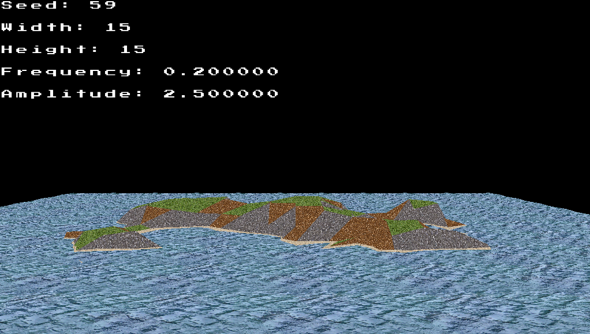

# Procedural Terrain Generation in OpenGL

Procedural terrain engine built 100% from scratch using OpenGL, FreeGlut and GLM. 

The program renders a pseudo-random island using Perlin noise and allows the user to change the island's parameters during runtime to generate different islands.

## Structure

The rendering process is divided in three phases:

1. World generation: the CPU defines the terrain mesh using Perlin Noise to determine each vertex height; later, the fragment shader defines each surface color using the surface height and slope to show sand, plains and rock textures

2. Water generation: as in world generation, water is defined by a triangular mesh; the vertex shader applies a movement effect using a distortion formula

3. GUI generation: the interface allows the user to change world parameters (seed, frequency, amplitude...)

## Sources

The core structure of the source code was provided by the teachers of the computer graphics course of the University of Milano-Bicocca; this core has been expanded to reach the goals of the project. 

General idea: https://medium.com/@sashminadhikari/introduction-to-opengl-procedural-terrain-generation-using-c-dd1d981eebd5

Water generation: https://www.youtube.com/watch?v=5yhDb9dzJ58

