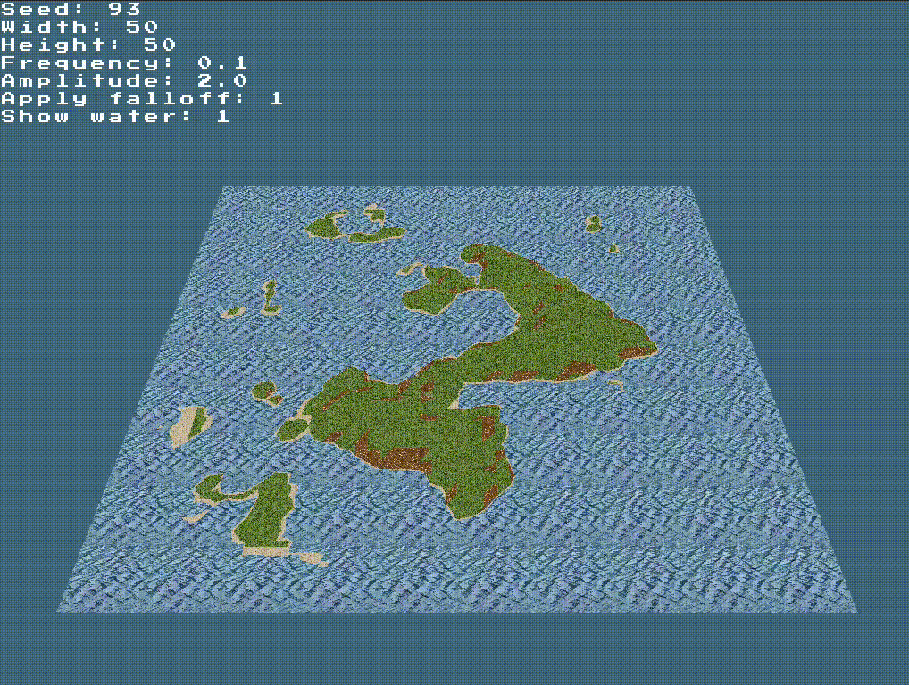

# Procedural Terrain Generation in OpenGL

Procedural terrain engine built 100% from scratch using OpenGL, FreeGlut and GLM. 

The program renders a pseudo-random island using Perlin noise and allows the user to change the island's parameters during runtime to generate different islands.



## Build

1. Clone the repository or download the [latest release](https://github.com/andrearanica/procedural-generation/releases/) from the releases page. 

    ``` bash
    git clone https://github.com/andrearanica/procedural-generation
    ```

2. Install the compiler: if you are using Windows you can install [MinGW32](https://github.com/brechtsanders/winlibs_mingw/releases/download/10.2.0-11.0.0-8.0.0-r7/winlibs-i686-posix-dwarf-gcc-10.2.0-llvm-11.0.0-mingw-w64-8.0.0-r7.7z) and extract it under `C:\`. On Linux you can use the default compiler which can be installed with the following command. 

    ``` bash
    sudo apt install build-essential
    ```

3. Libraries: on Windows you don't need to install anything manually, since libraries are stored inside the `base/` subfolder; on Linux you need to run the `install_dependencies.sh` script or manually run the following commands. 

    ``` bash
    sudo apt install mesa-utils
    sudo apt install freeglut3-dev
    sudo apt install libglew-dev
    sudo apt install libglm-dev
    sudo apt install assimp-utils
    ```

4. Compile: once everything is installed, you can compile and run the project
    ``` bash
    make
    make run
    ```

## Sources

The core structure of the source code was provided by the teachers of the computer graphics course of the University of Milano-Bicocca; this core has been expanded to reach the goals of the project. 

General idea: https://medium.com/@sashminadhikari/introduction-to-opengl-procedural-terrain-generation-using-c-dd1d981eebd5

Water generation: https://www.youtube.com/watch?v=5yhDb9dzJ58

Falloff function: https://www.youtube.com/watch?v=COmtTyLCd6I&list=PLFt_AvWsXl0eBW2EiBtl_sxmDtSgZBxB3&index=11
